# college-projects
Various Assignments using HTML, CSS, JS, jQuery, Less

Lab1a: 
Create a feedback survey for a car dealership using only HTML.
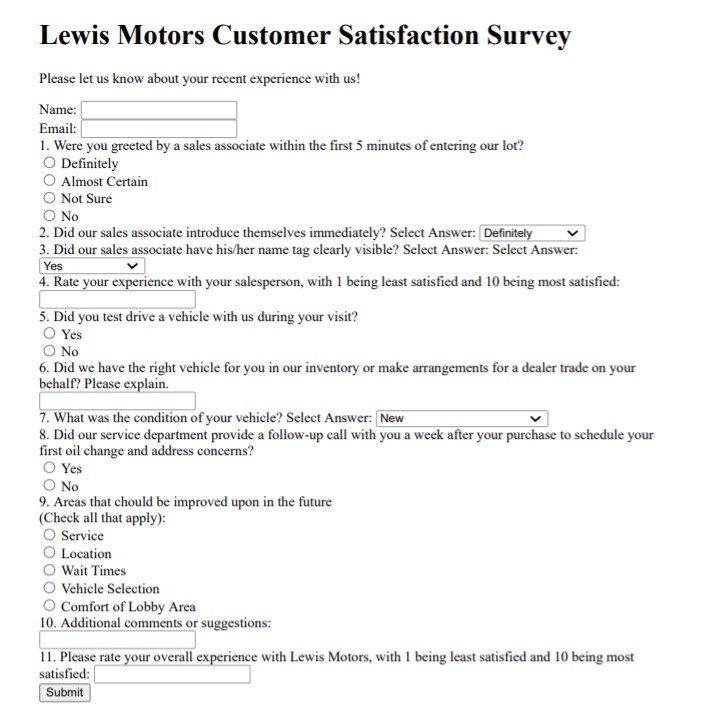

Lab1b:
Create a tour schedule for a traveling orchestra using HTML.
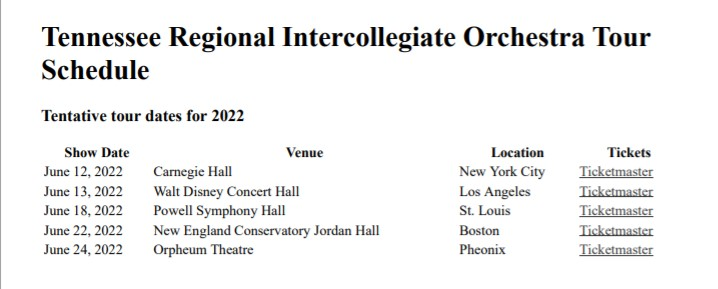

Lab2a:
Create a page that utilizes CSS to format a table of the first ten U.S. presidents, their home states, and their years in office per specifications provided. 
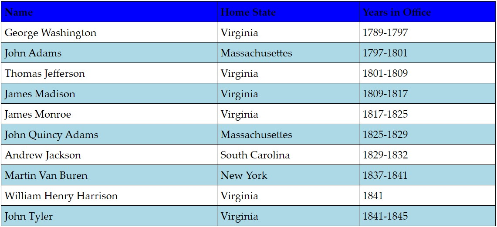

Lab2b:
Continuation of feedback survey, adding CSS.
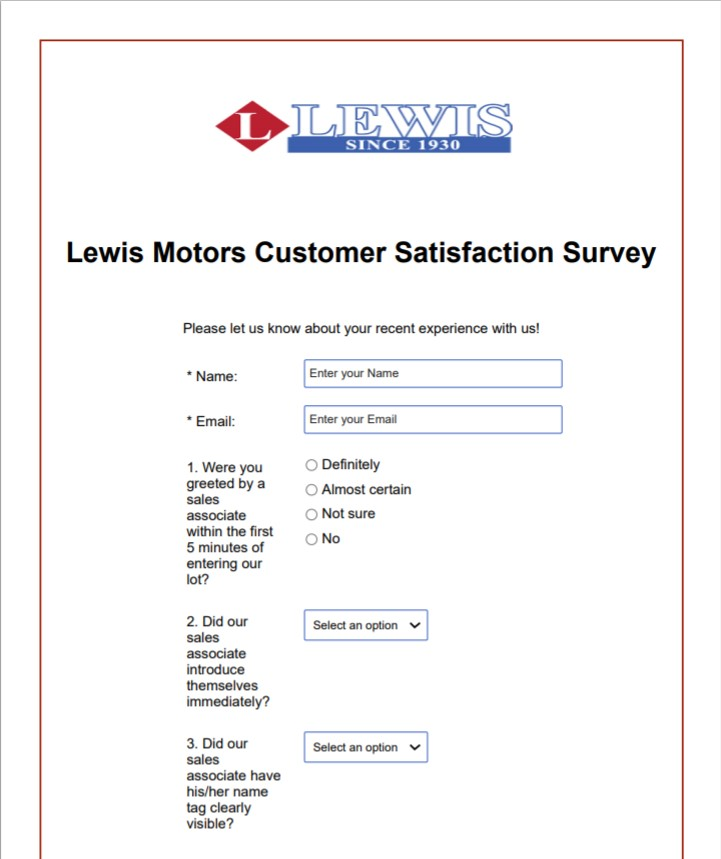
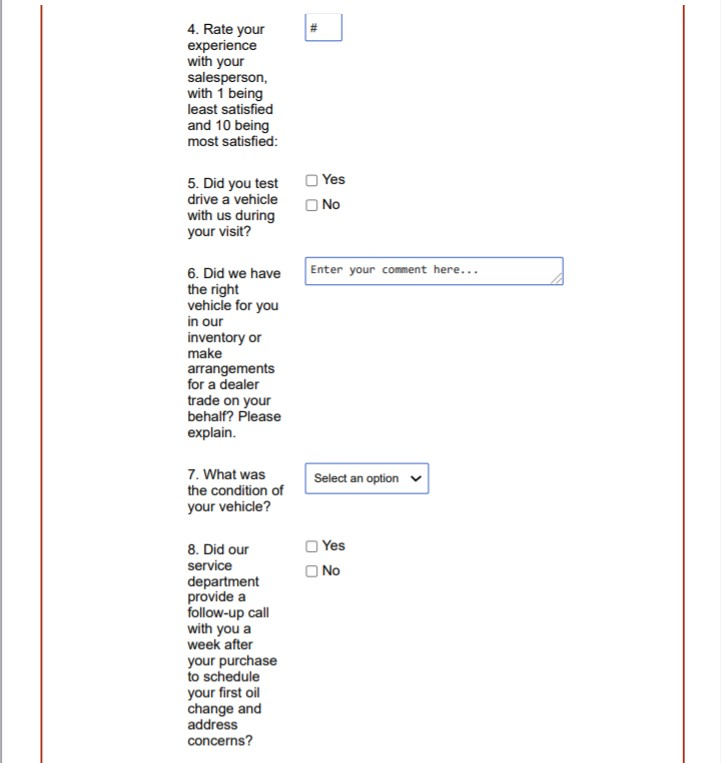
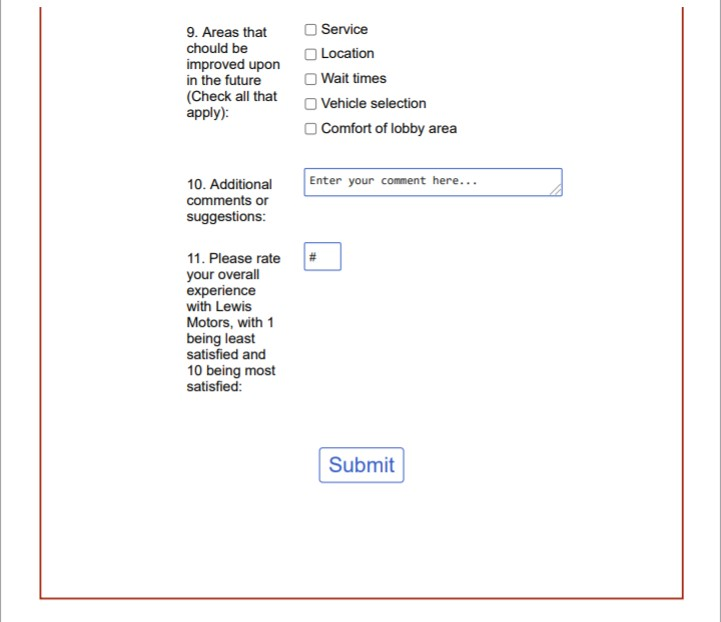

Lab2c:
Create a tour schedule for a traveling orchestra per specifications provided.
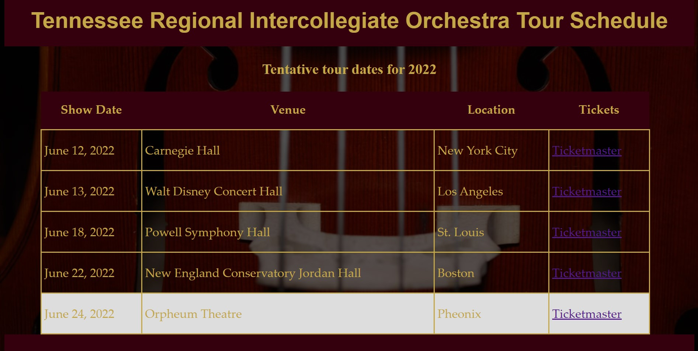

Lab3:
Modification from Lab 2 Part C utilizing LESS per specifications.

Lab4a:
Create an opening page (front page) for a website of a wildlife sanctuary for Canada geese using Bootstrap.
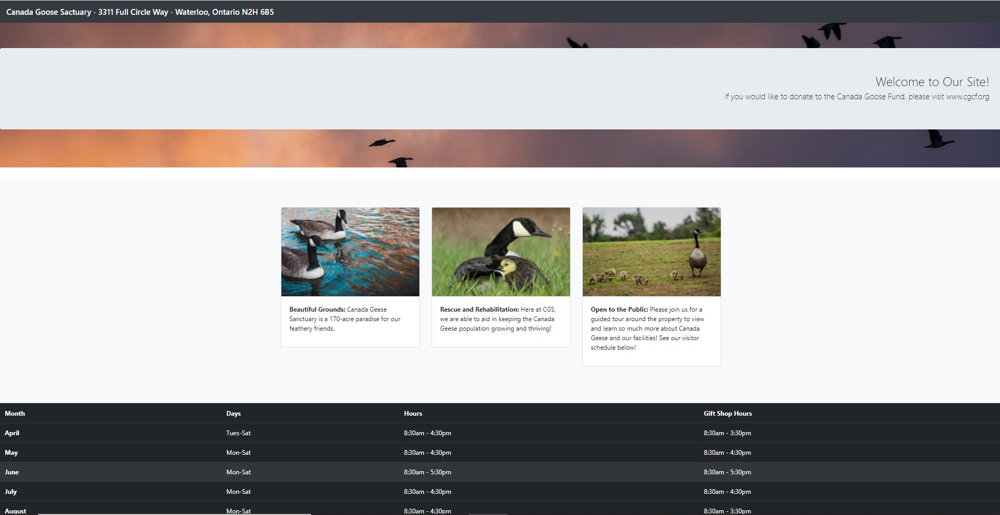

Lab4b:
Use Bootstrap to create a simple main page for the car dealership per specs provided.
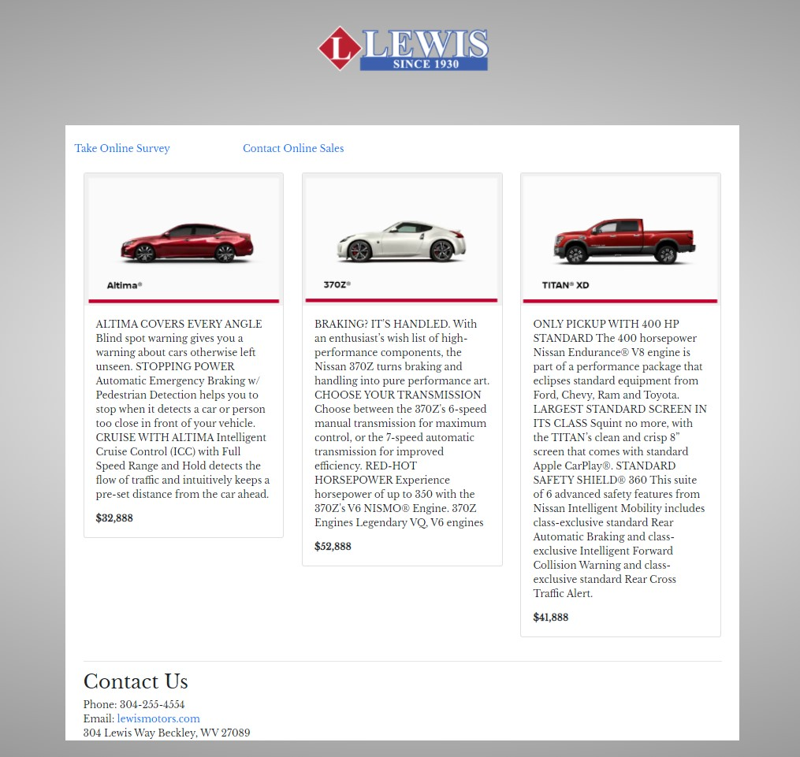

Lab5:
Continuation of feedback survey for a car dealership using JavaScript.

Lab6:
Create a project using jQuery.
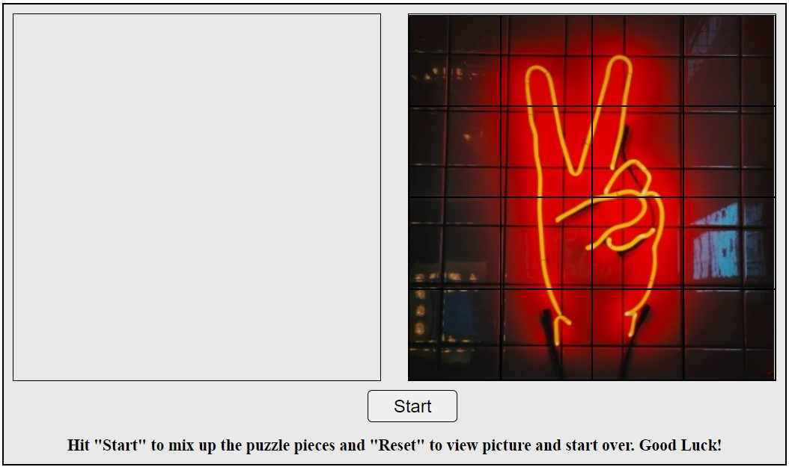
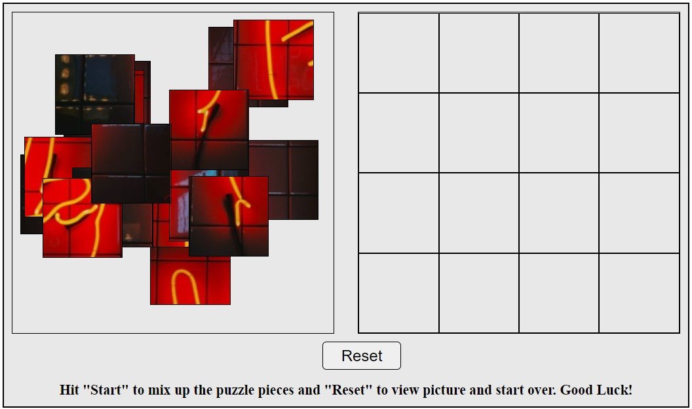

